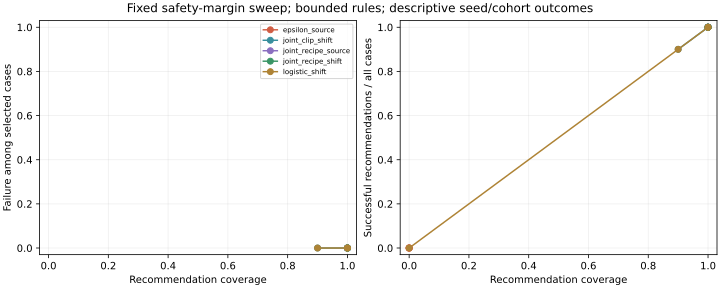
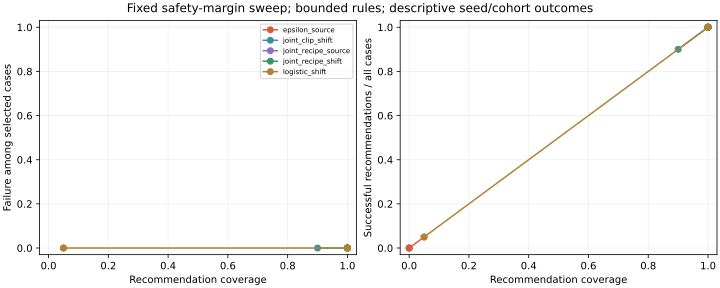

# Configuration-selection findings — 1 October 2026

**Verdict:** the extension is implemented and executed, but the survey and
results do not establish a novel selection method or an additional
success-yield benefit from shift-aware validation. The strongest current
position is a reproducible configuration/representation-sensitive empirical
benchmark with negative findings and explicit inference limitations.

## Executed evidence

- **840 model fits**: 420 on the primary hashed representation and 420 on
  prespecified decimal-digit sensitivity. Each run has 20 fresh seeds 200–219,
  three recipes, two norms, two finite budgets and matched ordinary/clipped
  controls. These are 40 seed/representation executions on shared archives,
  not 840 independent experimental replications.
- ACSIncome **2017** CA source, OR/WA validation, **CO/UT external tests**.
  This is a new year and two new test states relative to the 2018 pilot.
  It is not pure temporal transfer or cross-domain replication.
- Complete protocol, launch hashes, archive checksums, per-model accounting,
  frozen decisions, metrics, case outcomes and coverage/margin sweeps are saved.
- Complete-family calibration: **600 simulations**, 200 for each of three
  known Gaussian clustered scenarios, family 360 endpoints.
- **365 applicable tests passed**, five slow tests deselected; changed code
  and reporting script pass Ruff. Testing validates implementation, not novelty.

## Primary outcome and factorial interpretation

A successful case selects a candidate and satisfies the .03 relative AUC-gap
limit and .70 absolute AUC floor in **both** external states. Coverage is the
fraction of seed/cohort cases that receive a recommendation. Abstention is
zero successful yield and does not count as a failed selected model.

The following rows use uncertainty bounds and safety margin zero:

| Representation | Policy | Selected / cases | Successful / cases | Failed selected cases |
|---|---|---:|---:|---:|
| Hashed | Fixed-recipe epsilon-only, source | 0/20 | 0/20 | 0 |
| Hashed | Joint clipping, source | 20/20 | 20/20 | 0 |
| Hashed | Joint recipe, source | 20/20 | 20/20 | 0 |
| Hashed | Joint recipe, natural shift | 20/20 | 20/20 | 0 |
| Digits | Fixed-recipe epsilon-only, source | 1/20 | 1/20 | 0 |
| Digits | Joint clipping, source | 20/20 | 20/20 | 0 |
| Digits | Joint recipe, source | 20/20 | 20/20 | 0 |
| Digits | Joint recipe, natural shift | 20/20 | 20/20 | 0 |

The prespecified primary contrast (joint recipe/shift minus fixed epsilon/source)
is **+1.00** successful yield for hashing and **+0.95** for digit encoding.
The original paired t summary has a degenerate, explicitly unsupported interval
for the hashed contrast. Retain it as the original specified summary; do not
quote its zero-width interval as evidence of certainty.

The dated supplementary conservative paired binary intervals are **[0.6065,
1.0000]** and **[0.5239, 0.9994]** respectively, conditional on independent
seed-case streams and the fixed archives/environment split. They do not
estimate general unseen-state reliability. The supplementary procedure is
standard, not a new inference contribution.

**Crucial control:** source-only joint clipping/search achieves the same
successful yield as natural-shift joint search. The large primary contrast
mostly compares availability under a restricted known-sensitive configuration
with a wider configuration bank. It does not establish novel robustness,
superiority over competent source-only tuning, or a shift-validation benefit.
All policies train/evaluate from the same bank; logical search sizes are logged.
The wider policy has more candidate choices, so the comparison is not an
HPO-efficiency result. The fixed norm-1 baseline is motivated by the previous
study, but it is not a strong enough sole comparator for a methods claim.

Point-estimate fixed-recipe source rules select 10/20 hashed cases, all passing;
on digits they select 19/20, with 17 successful and two cases failing at least
one external environment. Representation affects decisions. Under bounds,
logistic-only shift selection succeeds in 20/20 cases for both encodings;
on digits its point version succeeds in 19/20. A non-neural DP baseline
therefore already handles these environments well.

At safety margin .01, both source-only and natural-shift joint rules still
select/succeed in all 20 cases under both encodings. The committed full curves
and exact-coverage comparison table retain every fixed margin pairing;
no margin is chosen using external failure outcomes.

## Configuration decomposition

On primary hashed source tests at epsilon 2, the base MLP's mean clipping gap
is about **.02884** at norm 1, versus **.00010** at norm 5. The added-noise gaps
are approximately **.00136** and **.01153**. Raising the norm changes the bias/noise
balance; it does not simply remove privacy cost. The stronger MLP has comparable
ordinary performance, so the result is not explained solely by the short
base training schedule. These are matched descriptive components, not an
isolated causal clipping effect. The common reference is selected by source
validation AUC; optimization, clipping and added-noise gaps sum to total loss.

## Calibration limitation

Observed simultaneous coverage is **.880, .945, .980**, versus nominal .95,
for prevalence/household scenarios (.1/100), (.3/250), (.5/250). Monte Carlo
standard errors are .0230, .0161, .0099. The rare-label small-cluster result
is material evidence against a universal nominal coverage claim. The other
scenarios do not establish general coverage either.

The bounds are asymptotic validation estimates. **Do not call these rules
certified, uniformly calibrated or finite-sample safe.** A computation-level
`bounds_supported` flag only checks nondegeneracy; it does not validate
statistical coverage. There is no guarantee for unseen states or all ACS
survey dependence. The exact paired yield interval addresses a separate
seed-outcome reporting problem and does not repair these AUC bounds.

## Novelty and submission gate

The [sixteen-source survey](../../docs/CONFIGURATION_SELECTION_LITERATURE.md)
rules out broad novelty in utility-first privacy selection, joint clipping/LR
search, HPO with OOD evaluation, and abstention/coverage reporting. No reviewed
source was identified as the exact same recommendation benchmark; that is
an evidence gap, not confirmation that this is first-of-its-kind.

The results satisfy the protocol's **narrow-to-replication** condition:
configuration search helps, but competent source-only search has equal yield.
Keep this direction as a configuration-sensitive tabular benchmark rather
than continually changing the hypothesis to obtain a novel positive result.

Before submission:

1. Scholarly full-text/citation-chain review and explicit venue-fit assessment
   of this empirical/negative-result contribution. Include adaptive/private HPO
   and automatic/adaptive clipping as stronger literature-informed comparators
   if pursuing an algorithm-superiority claim.
2. Address the AUC-bound calibration failure if inference reliability is a
   central claim. Otherwise keep the bounds an explicitly limited comparator,
   report the failed calibration, and make no certification claim.
3. Finalize author/affiliation, references, manuscript formatting and independent
   reproduction. The older PDF remains superseded.

Another unrelated dataset is optional for this narrow scope; it is needed
before a cross-domain claim. More seeds on this same split will not establish
methods novelty. A new algorithm would need a precise mechanism and independent
validation beyond this benchmark, not a renamed grid search.

## Reproduction and provenance

Execution used local protocol/source commit `e586e54`, with identical published
source tree `2b657f16473f8b120692d6c4661ad340f5c8829d` (remote protocol commit
`3871f7c5ddf0e1303ac5a93fa999fbe5a0c61332`). Every launch source hash was verified
against the completed implementation. No training/selection code changed during
these runs. Supplementary inference was added under `46e0454`, before inspecting
ACS decisions; original primary summaries remain intact. This is a prospective
execution record, not independent public preregistration before launch.

Per-candidate DP accounting does not compose the public research search,
ordinary controls, validation and release into a private deployment.
Fixed public preprocessing avoids learned private domains; household-separated
partitions do not establish household DP. The nominal income threshold is not
inflation-adjusted and the task is not survey-weighted population inference.

[Protocol and commands](../../docs/CONFIGURATION_SELECTION_PROTOCOL.md),
[pinned executed runtime](../../research/configuration_selection/runtime-requirements.txt),
[primary detailed report](acs_replication/report.md),
[representation detailed report](acs_digits/report.md).

