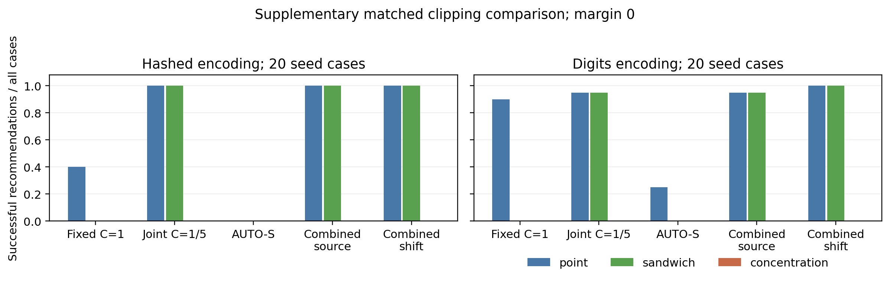
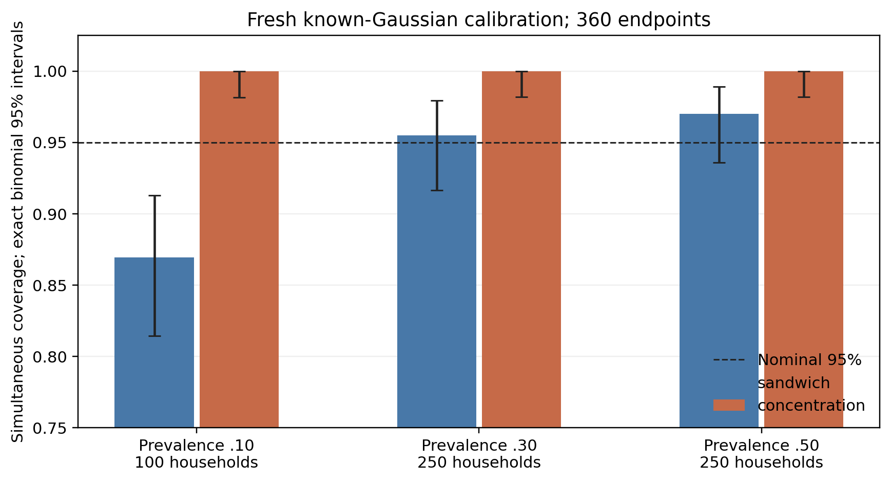

# Supplementary submission-gate findings — 1 October 2026

**Verdict:** the published comparator, fresh calibration, deeper targeted
review and review manuscript are complete. The supported scope remains a
descriptive replication/decision audit, without established method novelty,
useful ACS certification or tuned algorithm superiority.

## Execution

**400 new fits:** 200 per encoding, 20 fresh seeds 300-319, ten matched
fits/seed. AUTO-S follows Bu et al. (NeurIPS 2023), Eq. 4.1 / Appendix K.
Standard norms 1/5 and AUTO-S share the base 16-unit MLP, 50 epochs, LR .1,
epsilon 2/8. Stability .01 and unit sensitivity are fixed. One fixed ordinary
reference and six candidates over three validation environments give family
36, not the original three-recipe study's family 360.

The protocol was committed locally before launch; its identical tree was
pushed during execution at public commit
`9fe78890ed716b2f4ec808d7f3389d326acc203a`. Choices are written before external
scoring. The original state/year outcomes were already known, so these runs
are supplementary, not independently prospective external confirmation.

Saved-artifact verification checks launch source/protocol hashes, all fits,
accounting caps/delta, matched training streams, frozen decision agreement,
external states and decomposition identities. This is not a second full
reproduction or verification of the scientific assumptions. **372 applicable
tests pass**, five slow tests deselected; changed code/scripts pass Ruff.

## Comparator outcomes

Margin zero; success requires both CO/UT to meet gap <=.03 and AUC >=.70.
Abstention is zero successful yield, not a failed selected case.

| Encoding | Rule | Selected | Successful | Failed selected cases |
|---|---|---:|---:|---:|
| Hashed | AUTO-S source, point | 0/20 | 0/20 | 0 |
| Hashed | AUTO-S source/shift, sandwich | 0/20 | 0/20 | 0 |
| Hashed | Standard joint/combined source or shift, point or sandwich | 20/20 | 20/20 | 0 |
| Digits | AUTO-S source, point | 10/20 | 5/20 | 5 |
| Digits | AUTO-S shift, point | 2/20 | 2/20 | 0 |
| Digits | AUTO-S source/shift, sandwich | 0/20 | 0/20 | 0 |
| Digits | Standard joint/combined source, point or sandwich | 20/20 | 19/20 | 1 |
| Digits | Standard joint/combined shift, point or sandwich | 20/20 | 20/20 | 0 |
| Both | Every concentration-sensitivity rule | 0/20 | 0/20 | 0 |

AUTO-S does not improve yield under this fixed schedule. This does not
establish inferiority after appropriate LR/epoch tuning or reproduce its
original vision/NLP task suite. A published rule alone does not make a
recommendation reliable under an inherited recipe.

Combined shift-minus-source yield is 0 for hashing (paired conservative
interval [-.1968,.1968]) and .05 for digits ([-.1961,.2793]). The latter is one
case; its interval includes zero. No general shift benefit is established.
Retain the original independent replication's equal 20/20 yield too.

Every fixed margin-.01 outcome is saved alongside margin zero. No threshold
is chosen using test outcomes. Exact intervals concern independent seed
streams conditional on fixed archives/states; these descriptive supplementary
contrasts do not have an across-contrast multiplicity-adjusted claim.



## Fresh calibration

600 attempted draws, 599 valid under the original >=20 records/class rule.

| Prevalence / households | Sandwich coverage | Exact binomial 95% interval | Concentration coverage | Mean raw gap radius: sandwich / concentration |
|---|---:|---|---:|---|
| .10 / 100 | 173/199 = .8693 | [.8144,.9128] | 199/199 | .1404 / 1.1472 |
| .30 / 250 | 191/200 = .9550 | [.9163,.9792] | 200/200 | .0653 / .5901 |
| .50 / 250 | 194/200 = .9700 | [.9358,.9889] | 200/200 | .0486 / .5704 |

The rare-label undercoverage reproduces. **It is not fixed for ACS.** Standard
bounded differences gives a conditional finite-sample interpretation only
under the explicit independent score-generating household and common
conditional class-specific marginal-law assumptions. Those hold in the
Gaussian DGP and need not hold for survey data. See the derivation in
`docs/CLIPPING_FOLLOWUP_PROTOCOL.md`.

All valid simulated draws are covered; exact lower coverage limits are about
.982, not certainty or arbitrary-DGP proof. The bounds are wide and every ACS
policy abstains. The construction is a conservative assumption-dependent
sensitivity, **not a useful validated operational certification procedure**.
The manuscript excludes such certification from its contribution; a useful
calibrated selector remains future work.



## Submission route

Deeper methods/citation-chain checks cover Accuracy First, Brownian Noise
Reduction, Panda et al., R+R, Automatic Clipping and subsampled private HPO.
Evidence levels and inaccessible primary-source follow-ups are explicit.
The public-data bank implements neither private utility stopping nor adaptive
search's composed release guarantee. Broad novelty remains unsupported.

TMLR's criteria permit informative replication studies, so it is a plausible
route to assess, not confirmed suitability or acceptance. The 8-page
TMLR-style PDF is a review draft, **not submitted or under review**. Human
author/expert assessment of correctness and reader interest remains necessary.
See `docs/SUBMISSION_REVIEW.md` for the claim register and author review.

## Reproduction

Install the pinned runtime and editable repository. Use fresh output paths:

```bash
python -m dp.clipping_comparator --config research/configuration_selection/clipping_hashed.json --output-dir /tmp/reproduced_clipping_hashed --cache-dir /tmp/dp-config-acs
python -m dp.clipping_comparator --config research/configuration_selection/clipping_digits.json --output-dir /tmp/reproduced_clipping_digits --cache-dir /tmp/dp-config-acs
python -m dp.calibration_followup --config research/configuration_selection/calibration_followup.json --output /tmp/reproduced_calibration_followup.json
python -m pytest -m 'not slow' -q
python research/configuration_selection/summarize_followup.py
python research/configuration_selection/build_review_pdf.py
```

The summary verifies/plots committed runs without training. PDF building needs
Pandoc and pdfLaTeX. Raw Census archives stay outside Git. All privacy claims
remain per-candidate training claims, not composed research/search releases.
