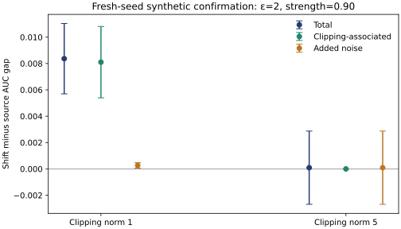
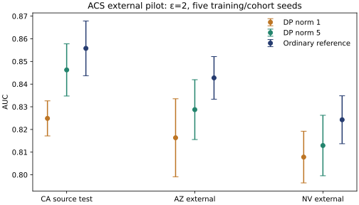

# Publication-stage findings — 30 September 2026

**Assessment:** substantial evidence and implementation progress; not yet a
submission-ready new-method paper. The defensible candidate is a reproducible
configuration-sensitive utility benchmark/negative-result paper.

## Completed work

| Stage | Replications | Fits | Evidence |
|---|---:|---:|---|
| Synthetic clipping development | 5 seeds × 2 strengths | 160 | [Report](clipping_development/report.md) |
| ACS five-state external pilot | 5 seeds | 40 | [Report](acs_external/report.md) |
| Prospective synthetic confirmation | 20 fresh seeds | 120 | [Primary result](confirmation/primary_result.json) |
| Predetermined ACS bootstrap sensitivity | Same seed-10 cell | 2 diagnostic retrains | [Result](acs_bootstrap.json) |

There are **322 new fits**, including repeated identical ordinary controls;
fits, environment evaluations and independent seeds are different counts.
The 400-repetition interval simulation does not train models.

## Supported findings

- Primary contrast: norm-1 minus norm-5 total shift interaction at ε=2,
  strength .90 and complete proxy removal is **0.008275 AUC**, paired-mean
  95% CI **[0.004092, 0.012458]**, p=.000556 over 20 new seeds. The effect is
  nonzero here; the interval straddles the .01 practical margin.
- The larger norm changes the clipping/noise balance. The result is specific
  to the fixed recipe and generator, not an isolated causal clipping estimate.
- In confirmation, every rule made the same selection. Failures were 20/40
  evaluations at norm 1 and 19/40 at norm 5. Proxy stress is **not shown to
  improve recommendation reliability**; evaluations share models.
- ACS norm-1 bounded rules abstain on all five seeds. At norm 5 every rule
  selects five seeds and all ten external evaluations pass. This is a
  fixed-state pilot, not a general failure-rate guarantee.
- Marginal simulation coverage was .950/.960; paired ACS influence/bootstrap
  gap upper bounds were .03419/.03436. One Gaussian DGP and one ACS cell do
  not establish simultaneous or survey-design coverage.

## Figures

Bars are marginal t intervals over 20 independent synthetic seeds. The
norm contrast, rather than any component bar, is the specified primary test.

Bars describe variation over five training/cohort seeds from fixed archives;
they are not confidence intervals over states. Raw per-seed values remain
in the committed CSVs.

## What remains before submission

1. Freeze an independent ACS replication using additional states or year,
   prospective seeds and a primary external outcome. Current five-state
   evidence remains exploratory.
2. Compare fixed representation alternatives and a validation-selected
   stronger baseline/training schedule. Check whether MLP recipe sensitivity
   explains the result; never tune against the external test outcomes.
3. Extend interval calibration to realistic skew/cluster dependence and the
   actual simultaneous selection family.
4. Obtain a supervisor/coauthor review of the incremental claim against the
   closest prior papers, then finalize target-venue formatting and references.

Another unrelated dataset is optional for this narrow benchmark. It is needed
for claims of cross-domain generality. ACS is already downloaded, implemented
and executed; it is no longer only future scope. The paper should not claim
a new DP mechanism, new uncertainty estimator or general proxy-stress benefit.

## Provenance and reproduction

- Development and ACS were launched with committed implementation `a26e831`.
  A stage-label/confirmation guard edit to `publication_study.py` occurred
  during these runs; training and selection behavior did not change in the
  running processes. Existing manifests preserve end-of-run source hashes,
  not immutable launch snapshots. This note records that limitation.
- Confirmation ran with implementation/protocol `1feb9fe`; its experiment
  finished before later runner provenance improvements. These local Git
  commits are launch records; they are not independent public preregistration.
- Runtime: Python 3.12; torch 2.14.1+cpu, Opacus 1.6.0, numpy 2.3.5,
  pandas 2.2.3, scipy 1.17.0, scikit-learn 1.8.0, matplotlib 3.10.8.
- Per-model prepared-record budgets do not compose the released research
  outputs into a private release or provide household DP.
- [Plan and commands](../../docs/PUBLICATION_PLAN.md),
  [editable manuscript](../../paper/proxy_shift_manuscript.md).
